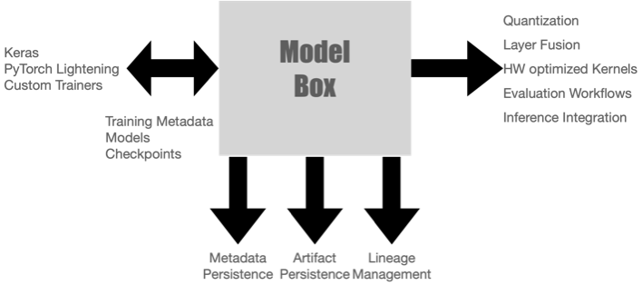

# Introduction

ModelBox is an AI model and experiment metadata management service. It provides primitives such as metadata management, model storage, distribution, and versioning for Deep Learning frameworks.

Metadata and events can be exported as a stream by other systems to facilitate bespoke workflows such as compliance, access control, auditing, and deployment of models.

## Features
#### Experiment Metadata and Metrics Logging
- Log hyperparameters, accuracy/loss, and other quality-related metrics during training.
- Log trainer events such as data-loading and checkpoint operations, epoch start and end times to help debug performance issues.

#### Model Management
- Log metadata associated with a model, such as binaries, notebooks, model metrics, etc.
- Manage the lineage of models with experiments and datasets used to train the model.
- Label models with valuable metadata for operational purposes, such as the services consuming them, privacy sensitivity, etc.
- Load models and deployment artifacts in inference services directly from ModelBox.

#### Events
- Log events about the system/trainer state during training and models from experiment jobs, workflow systems, and other AI/MLOps services.
- Any changes made to experiments and model metadata are logged as change events in the system. 
- External systems can watch events in real-time and trigger custom workflows.

#### SDK
- SDKs in Python, Go, Rust and C++ to integrate with ML frameworks and inference services.
- SDK is built on top of gRPC.

#### Reliable and Easy to Use Control Plane
- Features and APIs are designed with reliability in mind.
- The service is built and distributed as a single binary.
- Metrics related to the control plane, such as API latency, database connection stats, and system resource usage, are available as Prometheus metrics.

#### Extensibility
- Hackable and Interface first design 
- Additional data store backends can be supported easily.

## Supported storage backends

#### Metadata 
- MySQL
- PostgreSQL
- Ephemeral Storage

#### Metrics 
- Timescaledb
- Ephemeral Storage

#### Artifacts/Blobs
- AWS S3
- File System(Ephemeral, NFS)
